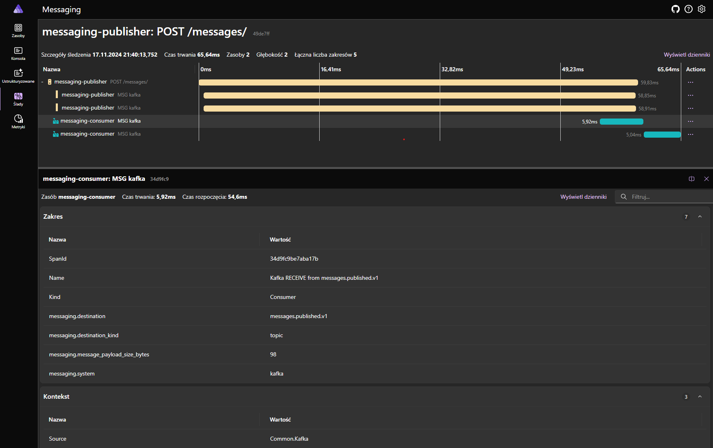
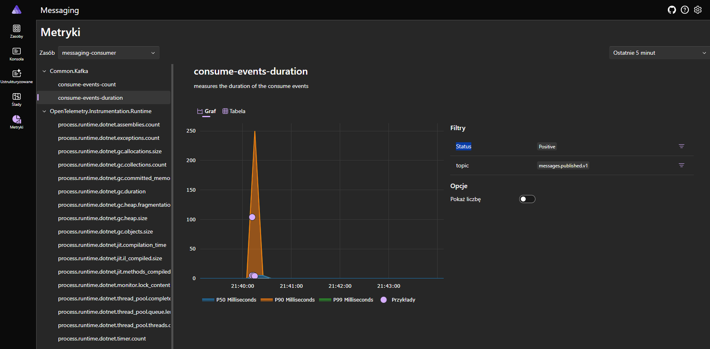

# Kafka-MessagingSample

An example of using apache kafka to send messages between applications

stack:
- Publisher.Api - sample .NET application to publish message
- Consumer.Api - sample .NET application to consume message
- Messaging.AppHost - sample .NET Aspire distributed application runtime 

- Docker
- Apache Kafka - distributed streaming platform

messages.published.v1 event on .NET Aspire Dashboard.

Custom histogram measures the duration of the consume events

